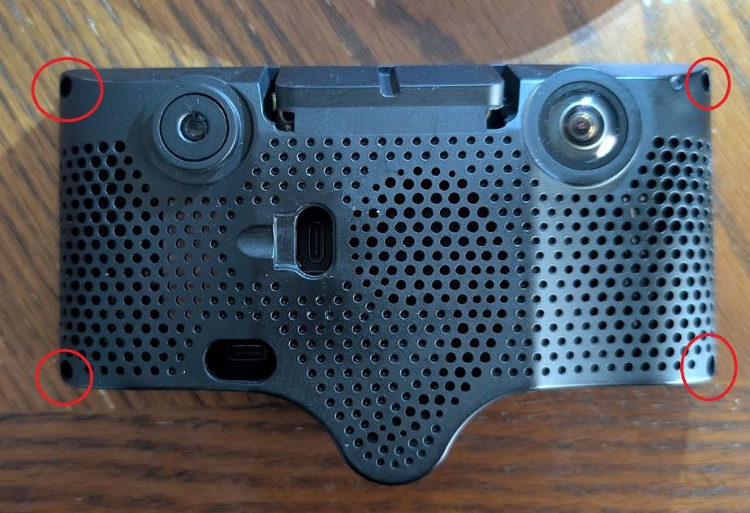
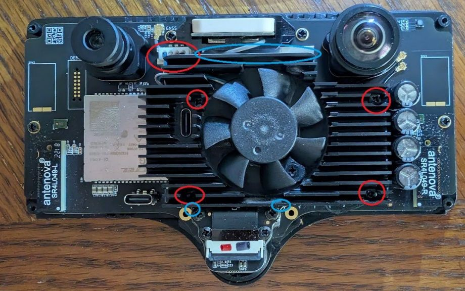
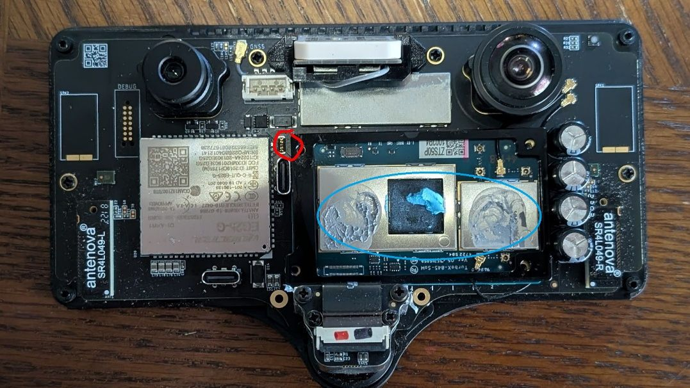
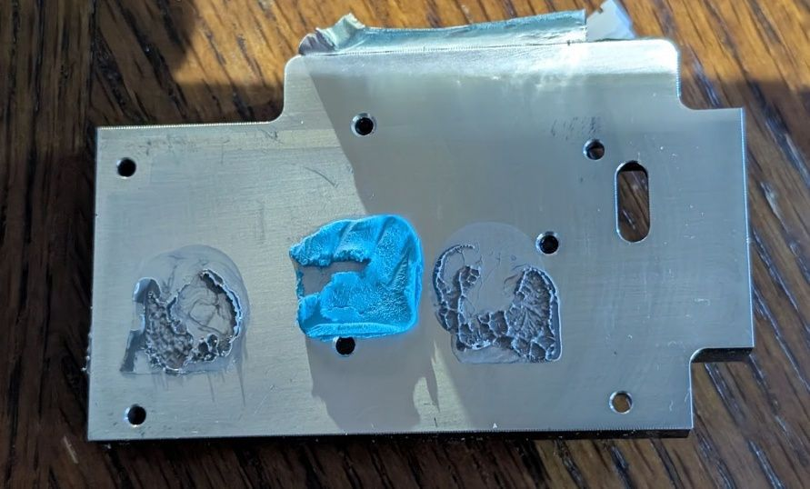
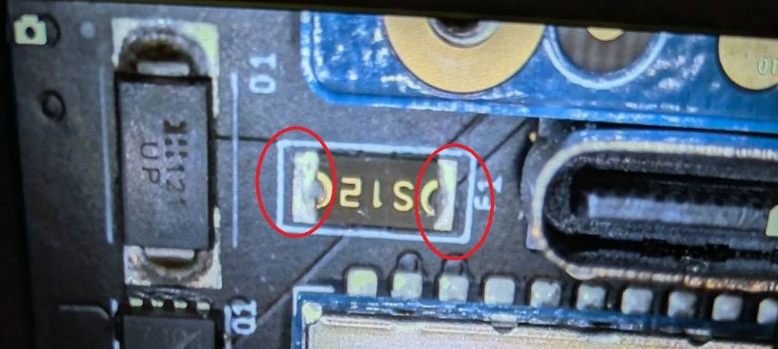
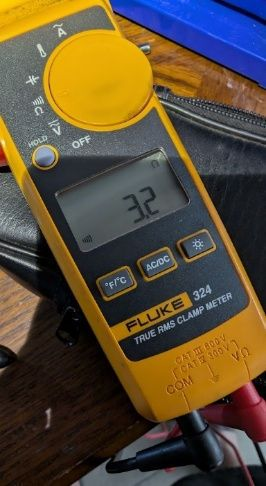
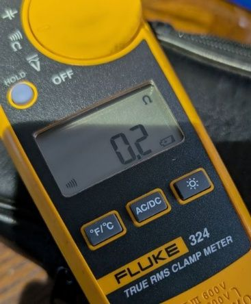

# whoisdomi's 2023 C3X fuse repair

Photographed repair account by **whoisdomi ('23 Ioniq 6 SEL)**, shared via Discord DM on September 24, 2026.

Adapted from his `Comma c3X fuse repair.pdf` into Markdown, with headings and units normalized. All seven photos are included at their original pixel dimensions, using the reviewed compressed copies.

This walkthrough describes his 2023 C3X. Refer to the [General Notes](../README.md#general-notes) and [The Blown Fuse Case](../README.md#the-blown-fuse-case) for the general troubleshooting and fuse-measurement guidance.

**Symptoms**:

On a reported 104°F day, he left the C3X on the windshield while eating lunch. After driving resumed, it operated for about a minute and suddenly shut off. He removed it from the windshield, let it cool in his office, and tried powering it on at his desk. The comma logo may have flashed once or twice, but it would not boot. The rear LED next to the camera flashed blue or red, sometimes erratically.

**Disassembly**:

1. Remove the four small Phillips case screws and slowly pry the body off. The red circles mark the screw locations.

   

2. Remove the four Phillips heatsink screws, disconnect the fan, and carefully peel back the aluminum foil tape at the three locations marked with blue ovals. Preserve the tape to reattach during reassembly.

   

3. With the heatsink removed, the fuse is visible inside the red circle. The blue oval surrounds the thermal paste and thermal putty.

   

   He replaced the thermal paste using material he already had at home, described in the original account as "quick silver." He reused the thermal putty by scraping it off the heatsink.

   

**Diagnosis**:

He measured the fuse in place by touching the meter leads to its two ends. The original fuse measured `3.2–4.6 Ω`.

The original account described roughly `0.2–0.4 Ω` as a good reading. These are the author's reported meter readings, not a general pass/fail threshold; probe-resistance compensation was not documented. Follow the [main guide's measurement instructions](../README.md#the-blown-fuse-case), including disconnecting power and accounting for probe resistance.

**Resolution**:

He ordered the already-listed S12 replacement, [Bourns `MF-NSML350-12-2` from Digi-Key](https://www.digikey.com/en/products/detail/bourns-inc/MF-NSML350-12-2/9859203).

He attempted to remove the fuse with a soldering iron but could not get the solder at its ends to melt. Someone suggested using a "heat gun," but he did not feel comfortable continuing the replacement himself and took it to a local phone repair shop instead. The shop charged $20 and completed the replacement the same day.

An amplifier repair shop had quoted $10, but lacked a microscope when he brought the device in and referred him to the phone shop. His suggestion was to call around and send prospective shops a close-up of the fuse next to something that provides a size reference.

After replacement, he measured `0.2 Ω` across the installed fuse.

**Reassembly**:

1. Put the thermal paste and putty back in place and set the heatsink on top.
2. Install the four heatsink screws.
3. Reconnect the heatsink fan.
4. Reattach the aluminum foil tape to the heatsink.
5. Attach the body and install its four screws.

[Return to The Blown Fuse Case](../README.md#the-blown-fuse-case).
